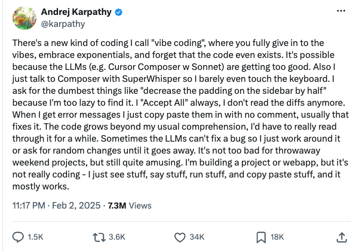

# Vibe_Coding_Workshop

```
Last updated 07/22/26
```

## **About Me**

### Link to recording of this workshop
- [View on PanOpto](https://nordvpn.com/link-checker/?srsltid=AfmBOopGtI-Joz1fRqE3V95zwog7rcU8HOFdvsICTwQM3tMMqkyYSTWo)
- [View on Youtube](https://nordvpn.com/link-checker/?srsltid=AfmBOopGtI-Joz1fRqE3V95zwog7rcU8HOFdvsICTwQM3tMMqkyYSTWo)


Erich Purpur

    Research Librarian for Science & Engineering
    epurpur@virginia.edu
    


These workshops are offered by [research data services](https://data.library.virginia.edu/) in the UVA Libraries. Research Data Services does these things:
    
1. Find and Manage Data
2. Data Analysis & Visualization
3. Workshops & Trainings (Like this one!)
4. Free Statistics & Technical Consultations in the [StatLab](https://library.virginia.edu/data/statlab)

## StatLab
* [StatLab](https://library.virginia.edu/data/statlab)
The UVA Library StatLab provides free statistics & similar technical consulting to students, faculty, staff at UVA

## Upcoming Workshops

| Workshop | Date | Time |
| ---- | ---- | ---- |
| Change Me                                                |       Test 1/1   |  3:00 - 4:30pm
| Change Me                                                |       Test 1/1   |  3:00 - 4:30pm
| Change Me                                                |       Test 1/1   |  3:00 - 4:30pm
| Change Me                                                |       Test 1/1   |  3:00 - 4:30pm
| Change Me                                                |       Test 1/1   |  3:00 - 4:30pm


----------------------------------------------------------------------------------------------------

# Vibe Coding
Vibe Coding is programming or software development assisted by AI where the human describes a project or task in a prompt to a Large Language Model (LLM), which generates source code. The human then reviews and refines the code to ensure accuracy and security.

### Origin of Vibe Coding
The origins of the term can be traced back to a [tweet by Andrej Karpathy](https://x.com/karpathy/status/1886192184808149383?lang=en) in 2025. 



### Benefits
- Low barrier to entry. Makes coding, programming, app building far more accessible to inexperience or non-technical audience
- Very fast prototyping of ideas

### Problems
- Erosion of code comprehension. If people never write code themselves anymore, your understanding of it will degrade.
- Chaotic Maintenance. Code bases become messy, inefficient, and hard to maintain.
- Security Risks. Vibe-coded applications lack proper validation, authentication, have hard-coded variables (such as API keys), and more.
- General AI Slop

----------------------------------------------------------------------------------------------------

### Evolution of Vibe Coding. From Chatbots to Agents
This is just my own observation. In fall of 2022, ChatGPT hit the scene, followed by a quick succession of similar tools like Google's Bard (now Gemini), Microsoft Copilot, and so on. All of a sudden, you could use the chatbot to write code for you in basically any language. It was, and still is, very helpful for short, isolated code snippets and scripts. However, a major problem was that it lacked the context to understand larger and more complicated codebases. 

Agentic AI became widely available in late 2024. Agentic AI programs have "agency", which allows them to make decisions under human guidance. They can create much more involved and complicated codebases with multiple files, folders, assets, all within the same project directory. This increased capability allows gives these tools a lot more power and functionality to create.
